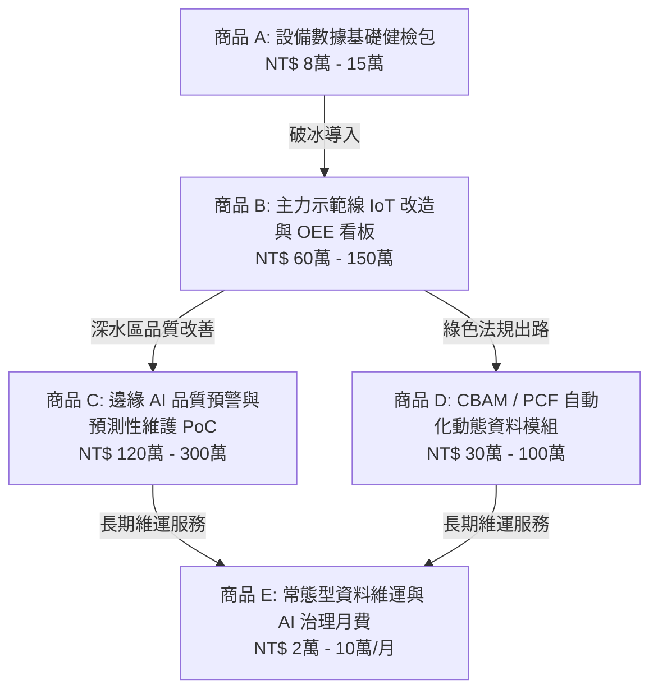

# 台灣扣件與金屬加工業 AI 數據化改造 ── 核心服務與商品報價結構

## 🎯 【定位宣告：工業數據智造總包商】
我們不賣虛幻的 AI 願景，也不做孤立的紙本碳盤查。我們是全台灣扣件產業與金屬加工業的**「AI 數據化改造總包商」**：
**「幫螺絲廠把老舊機台接上高頻數據，直接降低報廢與非預期停機損失，並『順便』自動產出國際客戶稽核必備的碳足跡（PCF）與生產履歷。」**

本服務結構徹底顛覆「純碳排顧問」的淺層思維。我們深知：**「碳排只是資料打通後的落後輸出（結果），傳統扣件廠最核心、最願意掏出真金白銀的痛點，永遠是營運端的良率、產能與成本（根基）。」**

---

## 📦 五大核心產品服務包 (Service Packages)

### 🏷️ 商品 A：扣件廠 AI / 碳 / 設備數據基礎健檢包
*   **適用對象：** 意欲導入智慧製造/綠色轉型，但面臨舊型設備無訊號輸出、不清楚如何編列下年度預算與對接政府補助之扣件廠企業主或總經理。
*   **定價結構：** 統一合約價 **新台幣 8 萬 ── 15 萬元**（依廠區規模與機台數量而定）。
*   **實體交付物 (Deliverables)：**
    1.  **廠區設備通訊與數位就緒度（AQVC 框架）現場診斷報告**：實地勘測打頭機、輾牙機、熱處理爐、包裝機之數位化狀態。
    2.  **機台聯網（SMB 智慧機上盒導入空間）實地盤點表**：標明傳統機械式凸輪設備的電氣與結構改裝可行性。
    3.  **現況生產合格率（OEE-Q）與突發停機損失基準線（Baseline）精算**：協助企業主清查隱形產能黑洞與成本損失。
    4.  **歐盟 CBAM / 產品碳足跡（PCF）資料缺口與法規風險曝險評估**：對標 2026 正式期歐盟規範，精查範疇一、二、三能耗數據收集瓶頸。
    5.  **經濟部產發署補助計畫（中小型低碳智慧升級、扣動旋件）適配性策略書**：精準試算如何運用補助款覆蓋高達 50% 以上之轉型 CapEx。
    6.  **單一廠區專屬「一條主力示範線 PoC 落地規劃書」與外部 SI 採購規格書草案**。

---

### 🏷️ 商品 B：主力示範線 IoT Retrofit 改造與 OEE 數據看板
*   **適用對象：** 已完成數據健檢，欲在 3 - 6 個月內看見產線即時稼動數據、建立數據化生管系統之工廠。
*   **定價結構：** 依專案規模與感測器數量，**新台幣 60 萬 ── 150 萬元**。
*   **實體交付物 (Deliverables)：**
    1.  **非破壞性外部感測器部署與加裝施工**：1 ── 3 台打頭機/輾牙機之高頻應變規（Stress Gauges）、接近開關、CT 鉗式電流計、模具溫度電阻之無損加裝。
    2.  **高頻智慧機上盒（SMB）數據採集系統部署**：支援 10 kHz - 20 kHz 超高頻取樣，完成地端邊緣數據邊界清理與預處理。
    3.  **地端工業級時間序列資料庫建置**：架設 InfluxDB / PostgreSQL，保證高頻物理特徵數據本地毫秒級連續寫入，不佔用昂貴頻寬。
    4.  **現場端 OEE 即時視覺化看板**：顯示即時生產速度、預計完工時間、非預期停機類別即時點選（如：調機、換模、卡料、待料）及電氣電流負載變化。
    5.  **自動化批次生產履歷系統**：將 ERP/MES 工單與地端機台訊號動態聯動，自動產出單批次螺絲的「能耗攤提」與「生產履歷數據」。

---

### 🏷️ 商品 C：邊緣端 AI 品質預警與模具預測性維護 (PdM) PoC
*   **適用對象：** 已部署聯網，飽受高速連續打頭崩模、高階車用螺絲微裂痕客訴、模具壽命難以掌控之出口型大廠。
*   **定價結構：** **新台幣 120 萬 ── 300 萬元**（依算法複雜度而定，接受以 KPI 改善幅度分階段付款驗收）。
*   **實體交付物 (Deliverables)：**
    1.  **沖頭連續衝擊之「黃金良品壓力波形基準資料庫」**：利用 10 kHz 高頻應變規採集正常鍛造狀態之應力軌跡。
    2.  **邊緣端自適應異常偵測與異常應力波形特徵分割演算法部署**：利用 CNN-Autoencoder 演算法於地端邊緣工控機（Edge IPC）實現 <10ms 的異常預警。
    3.  **模具殘存壽命（RUL, Remaining Useful Life）預測模型**：預警斷模風險，並與機台電氣緊急煞車迴路安全整合，在發生連續重擊崩模前 0.1 秒強制停機以保護昂貴模具。
    4.  **視覺化模型漂移監控系統**：基於白皮書之群體穩定性指標（PSI）自動計算模組，當 $PSI > 0.25$ 時發出預警並啟動模型本地微調。
    5.  **硬核 KPI 改善保證**：經雙方共同現場數據審計，承諾降低斷模停機時間 15% 以上、品質異常報廢率降低 20% 以上。

---

### 🏷️ 商品 D：CBAM / PCF 自動化動態資料模組
*   **適用對象：** 面臨歐盟（或其他國際大廠）直接稽核要求，必須提供確實而非估值之產品碳足跡（PCF）與能耗履歷之出口扣件大廠。
*   **定價結構：** **新台幣 30 萬 ── 100 萬元**。
*   **實體交付物 (Deliverables)：**
    1.  **「kgCO₂e/kpcs」（每千支螺絲碳足跡）動態自動計算引擎**：整合機台聯網採集之單一工單電量、天然氣能耗。
    2.  **製程碳排與範疇一、二動態攤提系統**：自動抓取並分攤空調、照明及廠務能耗至指定出貨工單。
    3.  **微型外包協力廠數據上傳專屬介面**：針對配合熱處理、酸洗、電鍍等外包協力廠，提供超簡易防呆式 Web API / LINE Bot 碳能耗上傳介面。
    4.  **出貨級產品碳足跡報告（PCF）自動產出模組**：一鍵生成符合 ISO 14067 與歐盟認證之合規出貨報告，從容應對國外客戶現場碳審計。

---

### 🏷️ 商品 E：常態型資料維運、AI 治理與結案支援（月費訂閱制）
*   **適用對象：** 已導入系統，但廠內無配置資料科學家、高階 IT 工程師之典型中小型扣件廠。
*   **定價結構：** 採月費制，每廠每月 **新台幣 2 萬 ── 10 萬元**（依維運機台規模與模型維護數量而定）。
*   **實體交付物 (Deliverables)：**
    1.  **每月全廠營運報告**：由 AI 轉型顧問固定派發「全廠 OEE 生產效能改善月報」與「能耗能效資產優化策略書」。
    2.  **邊緣端模型健康監控與後台定期微調**：針對線材批次變更或季節溫度引起的模型偏差，提供定期自動化地端模型重訓與演算法迭代。
    3.  **現場感測器精度校正與硬體例行巡檢**。
    4.  **國際車廠/買家現場稽核答辯技術支援**：協助面對客戶 IT/OT/ESG 資料架構審核，以及政府補助款結案審查之流動資料整理。
    5.  **現場種子教官培訓課程**：持續教育一線師傅與生管主管，建立人機協同（AI Champion）工廠文化。

---

## 🚀 變現漏斗 (Monetization Funnel) 實戰運作策略

我們在行銷端與客戶溝通時，主打**「政府補助 ＋ 商品 A（健檢）」的聯防攻勢**，解決製造業老闆對於前期高額投入的顧慮：

> [!TIP]
> **「以 8 萬 ~ 15 萬元低客單價的【數據健檢包】作為破冰磚。我們不只幫老闆抓出老機台的產能黑洞，還直接代筆撰寫經濟部產發署最高 250 萬 / 500 萬元的智慧低碳升級補助計畫書。當補助款順利通過後，老闆便能直接動用政府的輔導經費，來全額買單我們的【商品 B：主力示範線 IoT 改造】。老闆自己不花一毛自籌公本，就能完成全廠的數位與綠色聯防升級！」**

此模式將開源白皮書轉化為可落地、可零售的實體商品包，在台灣南部扣件聚落（岡山、路竹）創造最具爆發力的 B2B 轉換路徑！
